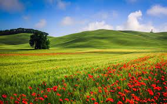
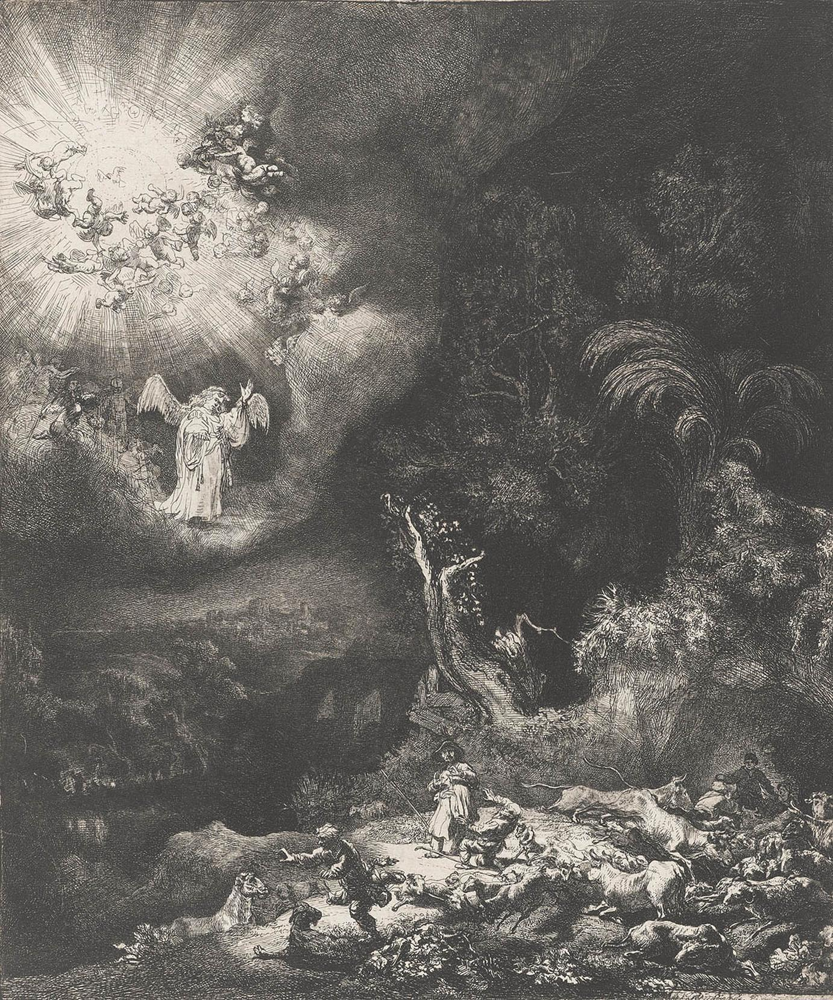
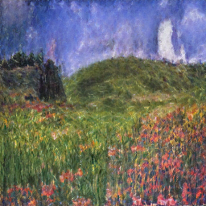
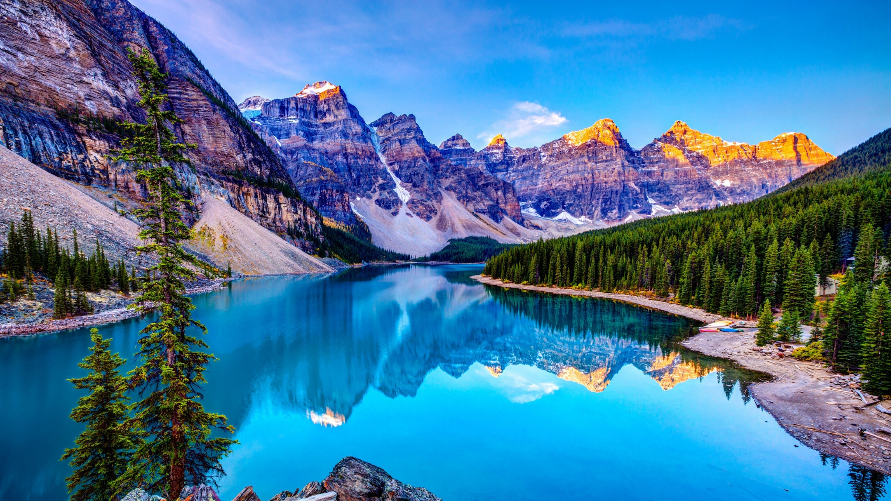
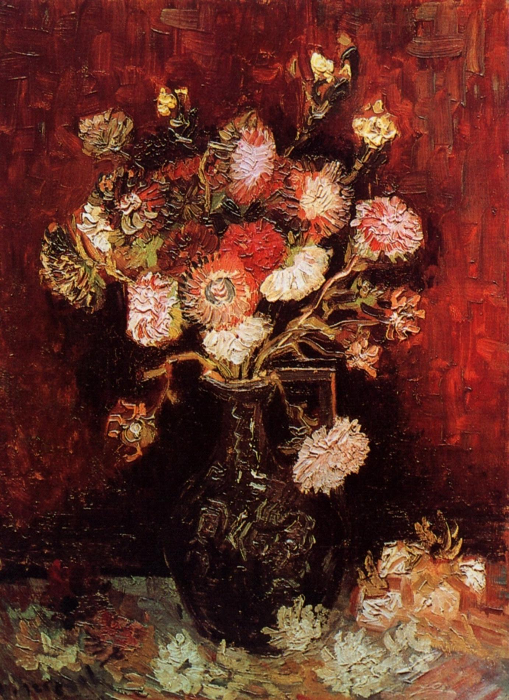
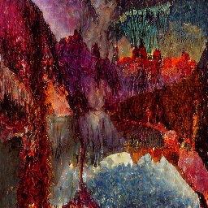
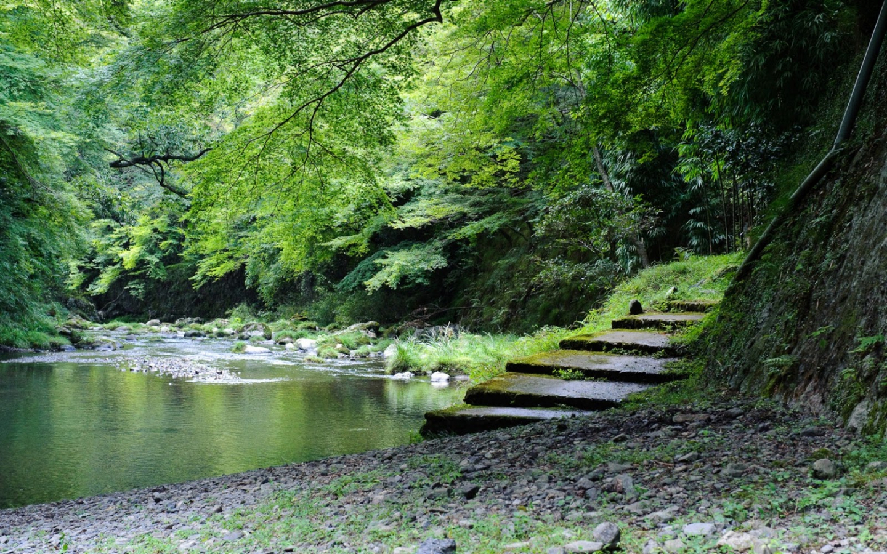
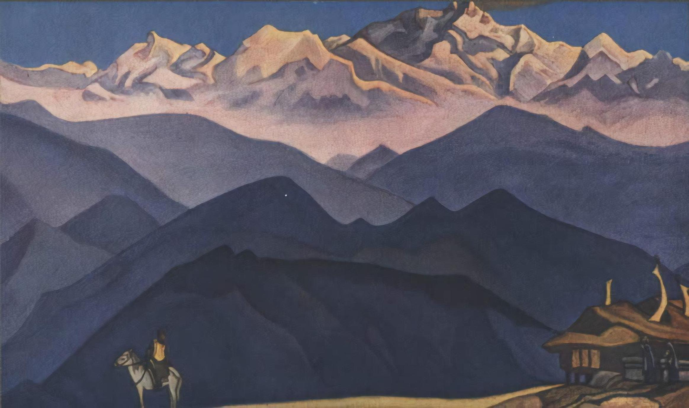
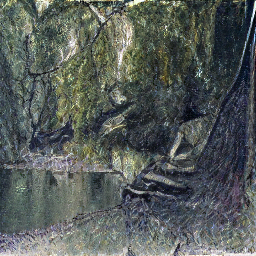

# Generative AI Style Transfer - QuantArt

## Overview
The project is about generative AI style transfer. Mainly, it aims to build an interface and UI for landscape to art style transfer using a method called QuantArt (QuantArt: Quantizing Image Style Transfer Towards High Visual Fidelity). The QuantArt model produces impressive results, particularly for landscape to art transformations, and exhibits strong generalization capabilities. The project's objective is to provide easy accessibility, allowing it to be utilized as part of other tech solutions like generating YouTube thumbnails, visuals for stories, and covers for posts. The project includes a layer built on top of the original GitHub repo, incorporating different models that utilize the QuantArt mechanism.

## Examples

#### Green Land Scape Art
<p align="center">
 +  = 
</p>

#### Lake Portrait

<p align="center">
 +  = 
</p>

#### Hand Drawn Forest

<p align="center">
 +  = 
</p>


## Quick Start
To quickly get started with the project, follow these steps:

1. Download the folder named `landscape2art` from [this Google Drive link](https://drive.google.com/drive/folders/1zuz9CmgpB7JsEx-Y5H0K0u3D95C6g4MU).
2. Place the downloaded folder inside the `QuantArt/logs` directory.
3. Run the following command in the project's root folder to create the Conda environment:
```shell
conda env create -f environment.yaml
```
4. Activate the `quantart` environment by running:
```shell
conda activate quantart
```
5. Launch the application by running:
```shell
streamlit run app.py
```

## Keynotes
- The project includes example landscape images and art styles provided in the `QuantArt/datasets` folder.
- Additional interesting styles can be downloaded from the ["wikiart" dataset](https://www.kaggle.com/competitions/painter-by-numbers/data).
- For detailed information on how QuantArt works, refer to the [original repository](https://github.com/siyuhuang/QuantArt/tree/main) that contains the associated research paper.

## Further Improvements
There are various potential improvements and expansions for this project, including:

- Developing a web application for art style transfer using this repository as a foundation.
- Enhancing the existing model through further training and exploring additional datasets.
- Experimenting with and integrating alternative style transfer models to extend the range of available artistic transformations.
- Applying the knowledge gained from this project to create interfaces for other generative AI applications.

Feel free to explore the similarities in using different models and mimic the approach taken to create the interface in this project.

## References
- [QuantArt GitHub Repository](https://github.com/siyuhuang/QuantArt/tree/main)

